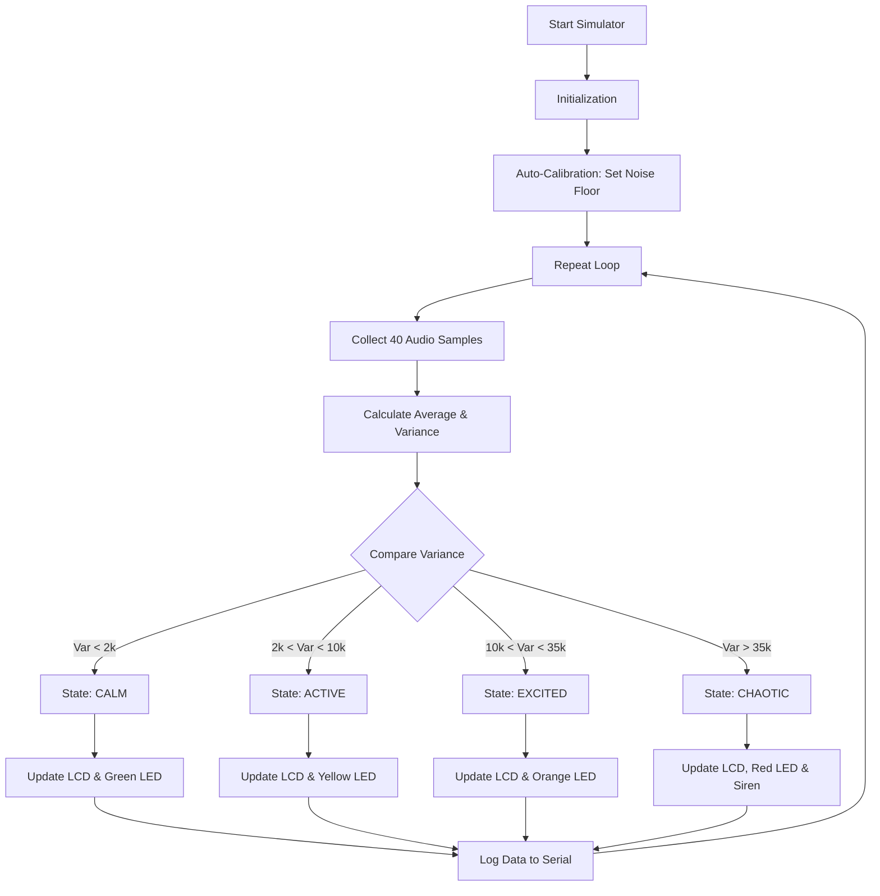

# 📊 System Flow Chart

This diagram represents the logical flow of the **Digital Crowd Mood Estimator**.

```mermaid
graph TD
    A[Start Simulator] --> B[Initialization]
    B --> C[Auto-Calibration: Set Noise Floor]
    C --> D[Begin Loop]
    D --> E[Collect 40 Audio Samples]
    E --> F[Calculate Average & Variance]
    F --> G{Compare Variance}
    
    G -- "Var < 2k" --> H[State: CALM]
    G -- "2k < Var < 10k" --> I[State: ACTIVE]
    G -- "10k < Var < 35k" --> J[State: EXCITED]
    G -- "Var > 35k" --> K[State: CHAOTIC]
    
    H --> L[Update LCD & Green LED]
    I --> M[Update LCD & Yellow LED]
    J --> N[Update LCD & Orange LED]
    K --> O[Update LCD, Red LED & Siren]
    
    L --> P[Log Data to Serial]
    M --> P
    N --> P
    O --> P
    
    P --> D[Repeat Loop]
```

---
**Prepared for IoT Semester Project.**
