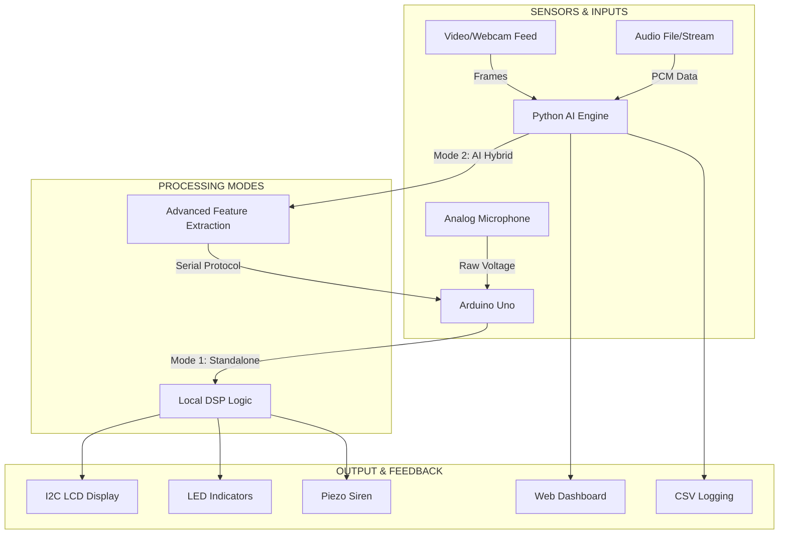

# 🌌 Vibe-Checker-IOT v2.0
### *Next-Gen Digital Crowd Mood Estimator & AI Hybrid Monitor*

Vibe-Checker-IOT is a sophisticated hybrid system designed to monitor, analyze, and visualize "crowd vibes" in real-time. By combining edge-computing on **Arduino** with advanced AI processing on a **PC**, it provides a multi-modal approach to understanding environmental energy levels through audio and video signals.

---

## 🏗️ System Architecture



---

## 🚀 Key Features

*   **Hybrid Dual-Mode Logic**: Seamlessly switches between local microphone analysis and high-fidelity PC-based AI streaming.
*   **Advanced Audio AI**: Uses `librosa` to extract RMS Energy, Zero-Crossing Rate, and Spectral Centroid for precise mood classification.
*   **Real-time Computer Vision**: Analyzes crowd activity via motion vectors, edge density, and contrast variability using OpenCV.
*   **Adaptive Normalization**: The Arduino firmware auto-calibrates to the noise floor and dynamically adjusts sensitivity based on peak tracking.
*   **Premium Web Dashboard**: A sleek, dark-mode visualization tool built with Chart.js for real-time monitoring and historical analysis.
*   **Automated Data Logging**: Generates session reports and CSV history for long-term trend analysis.

---

## 🛠️ Hardware Specifications

### Bill of Materials
- **Microcontroller**: Arduino Uno R3
- **Display**: LCD1602 with I2C Interface (PCF8574)
- **Sensors**: Analog Sound Sensor (Microphone)
- **Indicators**: 4x LEDs (Green, Yellow, Orange, Red)
- **Alerts**: Piezo Buzzer
- **Communication**: USB Serial (115200 Baud)

### Wiring Logic
| Component | Pin | Description |
|-----------|-----|-------------|
| Mic Sensor | A0 | Analog Input |
| LCD SDA | A4 | I2C Data |
| LCD SCL | A5 | I2C Clock |
| Green LED | D8 | Mood: CALM |
| Yellow LED| D9 | Mood: ACTIVE |
| Orange LED| D10| Mood: EXCITED|
| Red LED   | D11| Mood: CHAOTIC|
| Buzzer    | D12| Siren Alert |

---

## 🧠 AI Engine Logic

### Audio Analysis (`audio_mood_stream.py`)
The system calculates a "Vibe Score" (0-100) using a weighted formula:
$$Score = 0.65 \times RMS + 0.20 \times ZCR + 0.15 \times SpectralCentroid$$
- **RMS (Root Mean Square)**: Measures the volume/energy level.
- **ZCR (Zero Crossing Rate)**: Measures the "noisiness" or percussiveness.
- **Spectral Centroid**: Measures the "brightness" or frequency distribution.

### Video Analysis (`video_mood_stream.py`)
Activity is estimated by tracking changes in consecutive frames:
- **Motion**: Mean absolute difference between frames.
- **Contrast**: Standard deviation of pixel intensities.
- **Edge Density**: Percentage of Canny-detected edges (detects complexity).

---

## 💻 Software Setup

### 1. Arduino Firmware
Open `iot end sem.ino` in the Arduino IDE.
- Install `LiquidCrystal I2C` library.
- Set Board to **Arduino Uno**.
- Upload and note your **COM Port**.

### 2. Python Environment
Install dependencies:
```powershell
pip install -r requirements-video.txt
# Additional for audio mode
pip install librosa pygame pyserial numpy opencv-python
```

---

## 🎮 How to Run

### Standalone Mode
Simply power the Arduino. It will auto-calibrate for 2 seconds and start monitoring using the on-board microphone.

### AI Hybrid Mode (Video)
Stream mood from a video file or webcam to Arduino:
```powershell
python video_mood_stream.py --video 0 --port COM5 --show
```

### AI Hybrid Mode (Audio)
Play a track and sync the hardware vibes:
```powershell
python audio_mood_stream.py --audio "path/to/vibe.mp3" --port COM5
```

---

## 📊 Visualizations & Dashboard
The project generates several analytical charts located in the root directory:
- `vibe_heatmap.png`: Shows temporal density of different moods.
- `vibe_regression.png`: Correlates noise levels with mood scores.
- `vibe_feature_importance.png`: Breakdown of sensor contribution.

**Web Dashboard**: Open `dashboard/index.html` in any browser for a live-metering experience.

---

## 📂 Project Structure
- `iot end sem.ino`: Core Arduino firmware with Serial override logic.
- `video_mood_stream.py`: OpenCV-based crowd activity analyzer.
- `audio_mood_stream.py`: Librosa-based audio feature extractor.
- `dashboard/`: Premium HTML/JS visualization suite.
- `crowd_mood_history.csv`: Persistent log of all detected "vibes".
- `wokwi.toml`: Configuration for online simulation.

---
*Created as an IoT Semester Project. v2.0 - 2026*
